# Paris catacombs scan using an iPhone 14 LiDAR

You can find the project poster here :
- [English version](previews/project-poster-en.png) (EN)
- [Version française](previews/project-poster-fr.png) (FR)

You can find the project explanation slides here :
- [English version](previews/project-slides-en.png) (EN)
- [Version française](previews/project-slides-fr.png) (FR)


## Project steps
### 1. Manual scans of 3D data
Using the Lidar sensor and the cameras of an iPhone and the Polycam application.

### 2. Treatment and fusion of 3D scans
Assembly of scans on CloudCompare, cleaning on Meshlab, rendering and compression on Blender.

### 3. Creation of a visualization Webapp
Coded in Three.js to explore and analyze the Catacombs network and the surrounding places.

|  |  |  |
|--|--|--|
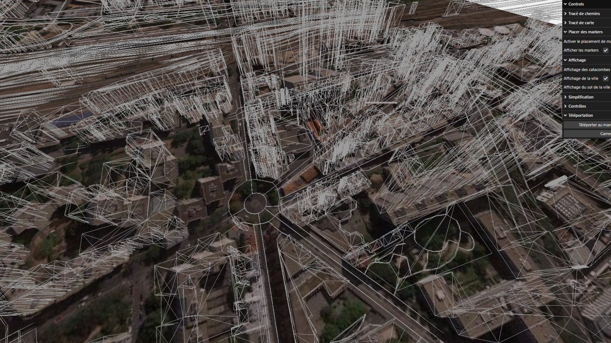 Merge between catacombs and actual map | 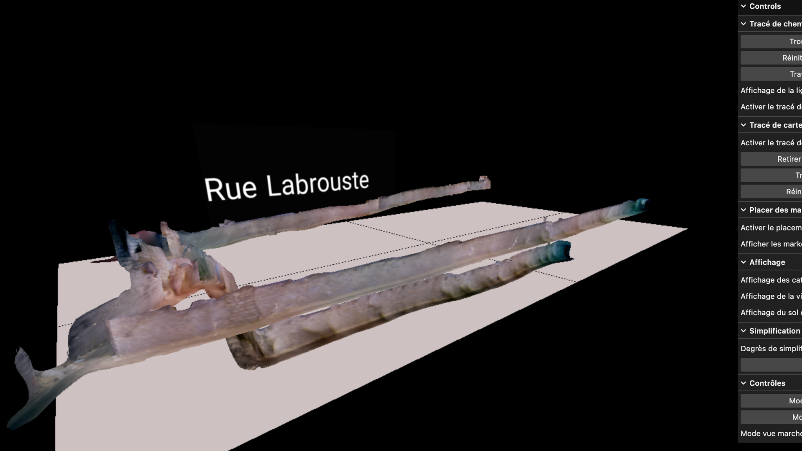 Independent scans exploration | 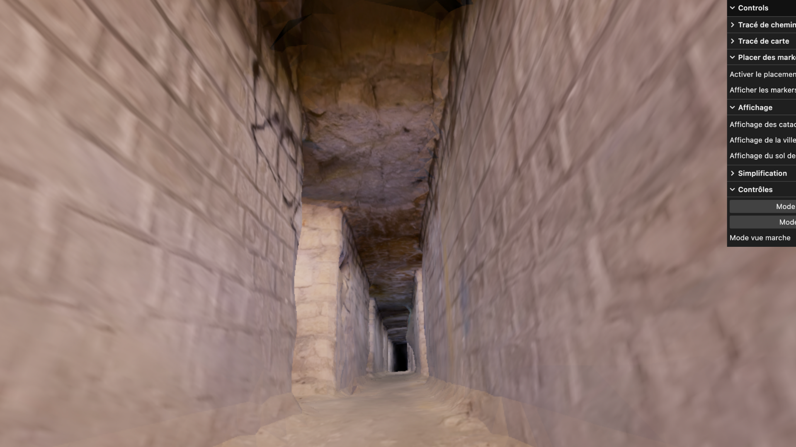 FPV view and controls

### 4. Implementation of a VR visit of scans
Using an OCULUS Quest VR headset and the Sketchfab platform to configure the 3D scene.

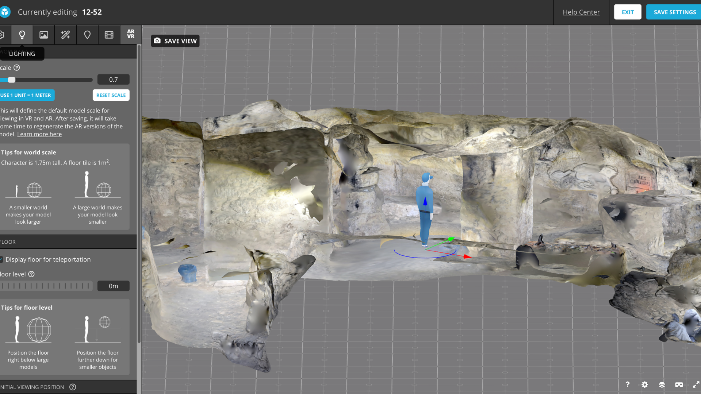


## Project progress
### 1. Manual scans

|  |  |
|---|---|
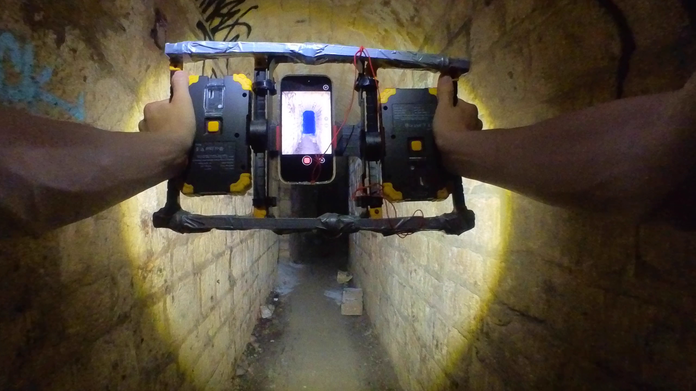 | 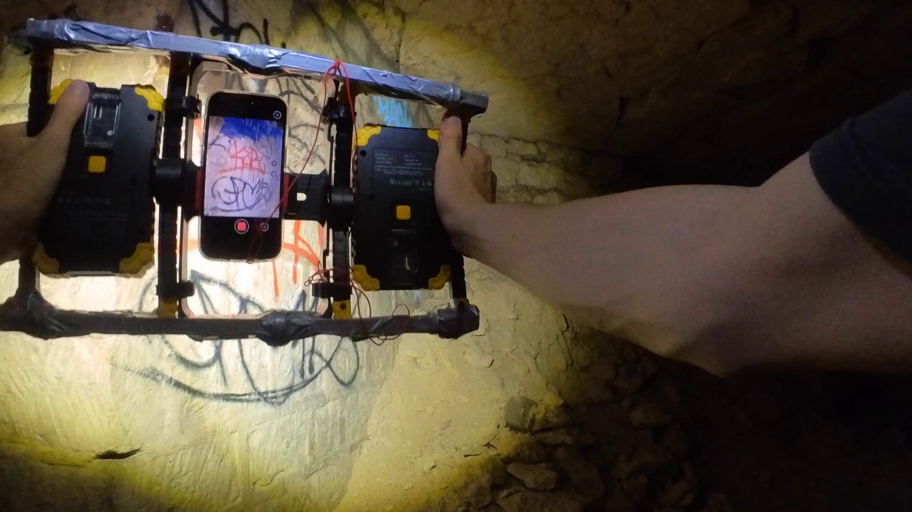

Specific equipment:
- iPhone equipped with a lidar
- Polycam app
- Scan support equipped with battery lamps 
- physical landmark

|  |  |
|---|---|
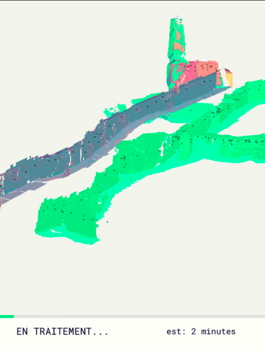 Polycam scan | 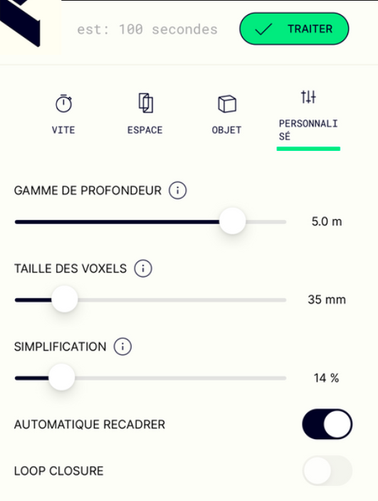 Polycam settings


### 2. Scans processing
Steps :
- Alignment and fusion with CloudCompare
- Cleaning and filling with Meshlab
- Remailing and rendering with Blender

|  |  |  |
|---|---|---|
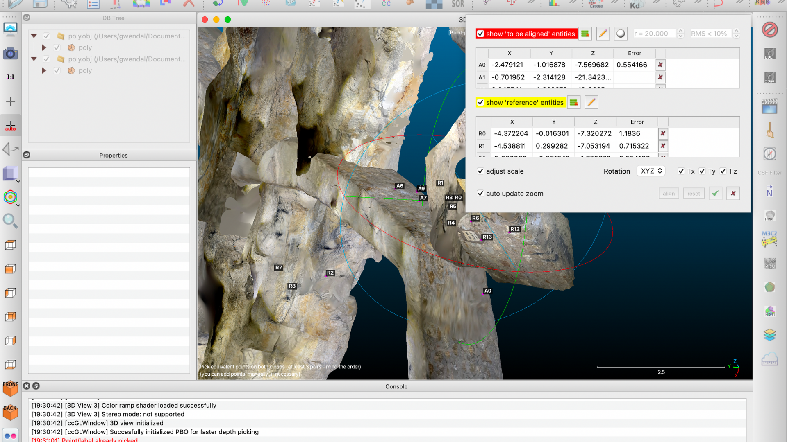 CloudCompare | 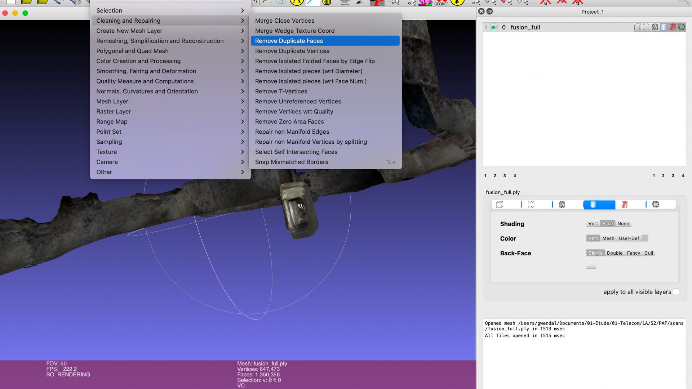 MeshLab | 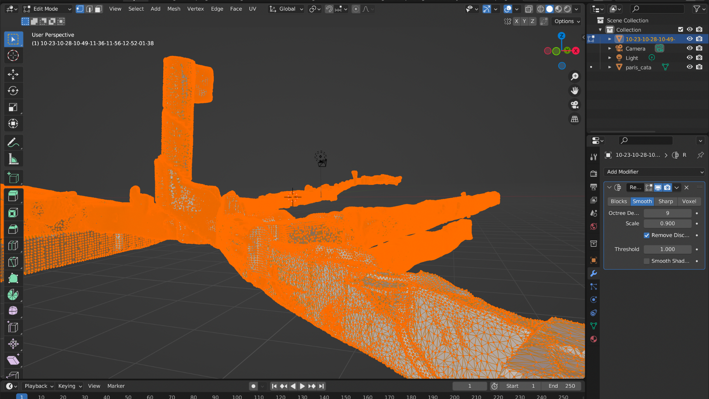 Blender

*8 merged scans, >4M of triangles on all scans & 5 3D formats treated: .glb, .obj., .Ply, .las and .xyz*


### 3. 3D visualization of the surface and the basement
- 3D reconstruction of tracks and buildings on blender from satellite images, SRTM elevation data and OSM requests
- Fusion and display on a website of surface data and 3D scans

Plugin used : [BlenderGIS](https://github.com/domlysz/BlenderGIS)

|  |  |
|---|---|
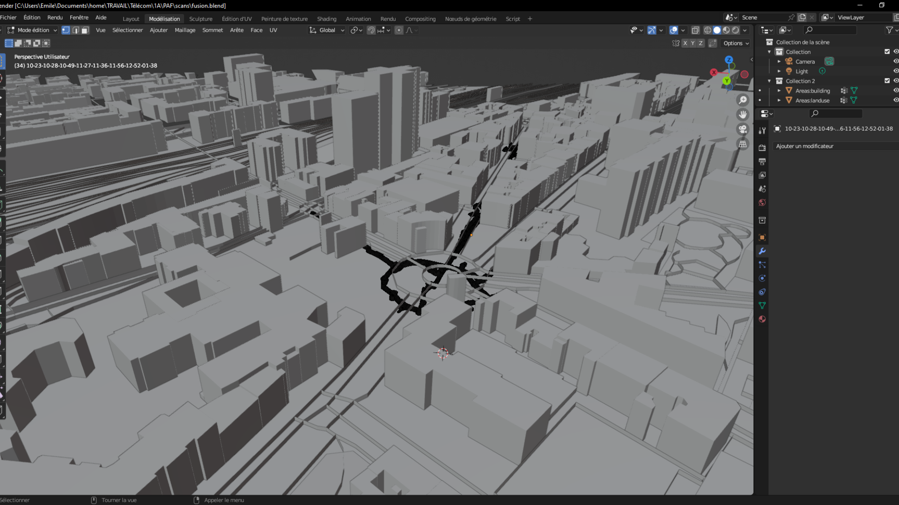 | 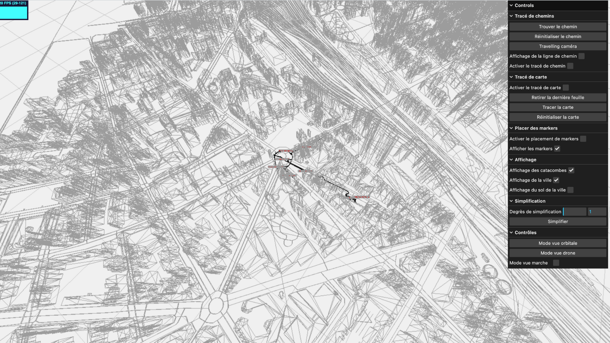


## Contributing

### Requirements
This project relies on [Three.js](https://threejs.org/) and [Vite](https://vitejs.dev/)

### Running locally

Clone the project :
```
git clone https://gitlab.com/minifixio/catacombs-scan.git
```

Install required packages :
```
npm install
```

Run the app in *staging* mode :
```
npx vite --mode staging
```